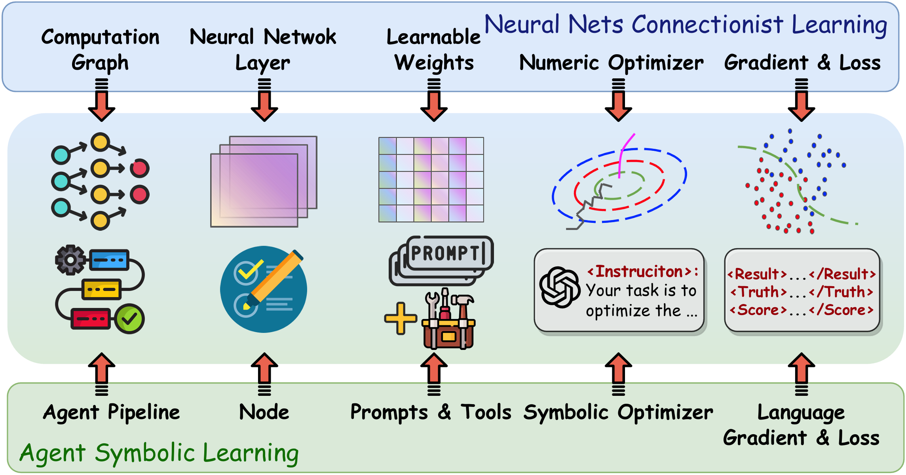

<div align="center">


## <p align="center">Agents 2.0: Symbolic Learning Enables Self-Evolving Agents</p>

<p align="center">
<a href="https://oe-heart.github.io/Agents2.0/">[🤖Project]</a>
<a href="">[📄Paper]</a>
<a href="https://agentsv2.readthedocs.io/">[📝Docs]</a>
<a href="#overview">[🌟Overview]</a>
<a href="#installation">[🔧Installation]</a>
<a href="#citation">[🚩Citation]</a>
</p>


[](https://opensource.org/license/apache-2-0)

 

---

</div>


## 🔔News
- [2024-06-25] We release Agents 2.0, a major update to the original library, adding support for agent learning and evaluation.
---

## 🌟Overview

Agent symbolic learning is a systematic framework for training language agents, which is inspired by the connectionist learning procedure used for training neural nets. We make an analogy between language agents and neural nets: the agent pipeline of an agent corresponds to the computational graph of a neural net, a node in the agent pipeline corresponds to a layer in the neural net, and the prompts and tools for a node correspond to the weights of a layer. In this way, we are able to implement the main components of connectionist learning, i.e., backward propagation and gradient-based weight update, in the context of agent training using language-based loss, gradients, and weights.



We implement loss function, back-propagation, and weight optimizer in the context of agent training with carefully designed prompt pipelines. For a training example, our framework first conducts the "forward pass" (agent execution) and stores the input, output, prompts, and tool usage in each node in a "trajectory". We then use a prompt-based loss function to evaluate the outcome, resulting in a "language loss". Afterward, we back-propagate the language loss from the last to the first node along the trajectory, resulting in textual analyses and reflections for the symbolic components within each node, we call them language gradients. Finally, we update all symbolic components in each node, as well as the computational graph consisting of the nodes and their connections, according to the language gradients with another carefully designed prompt. Our approach also naturally supports optimizing multi-agent systems by considering nodes as different agents or allowing multiple agents to take actions in one node. 

---

## 🔧Installation

**Installation from git repo branch:**
```
pip install git+https://github.com/aiwaves-cn/agents@master
```

**Installation for local development:**
```
git clone -b master https://github.com/aiwaves-cn/agents
cd agents
pip install -e .
```

---

## ⭐ Star History  
[](https://star-history.com/#aiwaves-cn/agents&Date)

---

## 🚩Citation

If you find our repository useful in your research, please kindly consider cite:
```bibtex
@article{zhou2023agents,
      title={Agents: An Open-source Framework for Autonomous Language Agents}, 
      author={Wangchunshu Zhou and Yuchen Eleanor Jiang and Long Li and Jialong Wu and Tiannan Wang and Shi Qiu and Jintian Zhang and Jing Chen and Ruipu Wu and Shuai Wang and Shiding Zhu and Jiyu Chen and Wentao Zhang and Ningyu Zhang and Huajun Chen and Peng Cui and Mrinmaya Sachan},
      year={2023},
      eprint={2309.07870},
      archivePrefix={arXiv},
      primaryClass={cs.CL}
}
```
