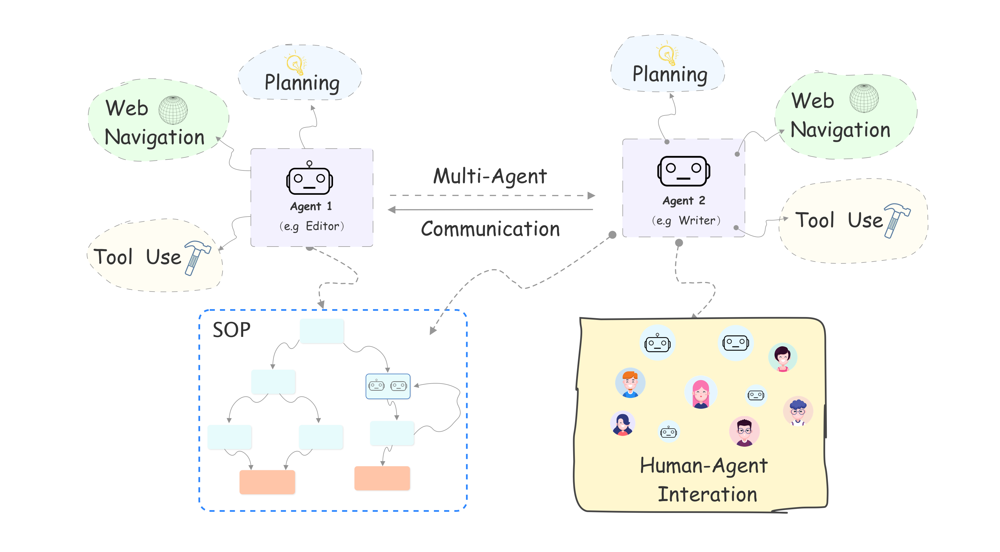

# <p align="center"> </p>
## <p align="center" style="display:inline-block;"><font  face="Calisto MT"><font  size="4">An Open-source Framework for Autonomous Language Agents</font></font></p>

<p align="center"><a href="https://arxiv.org/pdf/2309.07870.pdf">[📄 Paper]</a>
<a href="http://www.aiwaves-agents.com/">[🌐 Website]</a>
<a href="#web-demos">[🤖️ Demos]</a>
</p>
<hr>
  

## Overview

**Agents** is an open-source library/framework for building autonomous language agents. The library is carefully engineered to support important features including **long-short term memory**, **tool usage**, **web navigation**, **multi-agent communication**, and brand new features including **human-agent interaction** and **symbolic control**. With **Agents**, one can customize a language agent or a multi-agent system by simply filling in a config file in natural language and deploy the language agents in a terminal, a Gradio interface, or a backend service.

One major difference between **Agents** and other existing frameworks for language agents is that our framework allows users to provide fine-grained control and guidance to language agents via an **SOP (Standard Operation Process)**. An SOP defines subgoals/subtasks for the overall task and allows users to customize a fine-grained workflow for the language agents.

<p align="center"></p>

## 📢 Updates

- [ ] Support LLM-based SOP generation
- [x] 2023.9.12 Offical Release

## 💡 Highlights

- **Long-short Term Memory**: Language agents in the library are equipped with both long-term memory implemented via VectorDB + Semantic Search and short-term memory (working memory) maintained and updated by an LLM.
- **Tool Usage**: Language agents in the library can use any external tools via [function-calling](https://platform.openai.com/docs/guides/gpt/function-calling) and developers can add customized tools/APIs [here](https://github.com/aiwaves-cn/agents/blob/master/src/agents/Component/ToolComponent.py).
- **Web Navigation**: Language agents in the library can use search engines to navigate the web and get useful information.
- **Multi-agent Communication**: In addition to single language agents, the library supports building multi-agent systems in which language agents can communicate with other language agents and the environment. Different from most existing frameworks for multi-agent systems that use pre-defined rules to control the order for agents' action, **Agents** includes a *controller* function that dynamically decides which agent will perform the next action using an LLM by considering the previous actions, the environment, and the target of the current states. This makes multi-agent communication more flexible.
- **Human-Agent interaction**: In addition to letting language agents communicate with each other in an environment, our framework seamlessly supports human users to play the role of the agent by himself/herself and input his/her own actions, and interact with other language agents in the environment.
- **Symbolic Control**: Different from existing frameworks for language agents that only use a simple task description to control the entire multi-agent system over the whole task completion process, **Agents** allows users to use an **SOP (Standard Operation Process)** that defines subgoals/subtasks for the overall task to customize fine-grained workflows for the language agents.


## 🛠 Installation

#### Option 1.  Build from source

    
    git clone https://github.com/aiwaves-cn/agents.git
    cd agents
    pip install -e . 
    

#### Option 2.  Install via PyPI

    
    pip install ai-agents
    

##  📦 Usage
### 🛠️ Generate the config file

#### Option 1. Fill in the config template manually

Modify `example/{Muti|Single_Agent}/{target_agent}/config.json`

#### Option 2. Try our [WebUI](http://www.aiwaves.cn/create-agent/) for customizing the config file.

Haven't figured out how to write the JSON file yet? Check out our [documentation](https://agents-readthedocsio.readthedocs.io/en/latest/index.html)!


### 🤖️ The Agent Hub

We provide an **AgentHub**, where you can search for interesting Agents shared by us or other developers, try them out or use them as the starting point to customize your own agent. We encourage you to share your customized agents to help others build their own agents more easily! You can share your customized agents by submitting PRs that adds configs and customized codes [here](https://github.com/aiwaves-cn/agents/tree/master/examples/Community_Agent). You can also send us your own config files and codes for customized agents by [email](mailto:contact@aiwaves.cn), and we will share your examples and acknowledge your contribution in future updates!

_A WebUI for automatically uploading of your customized agents will be available soon!_


## 📷 Examples and Demos

We have provided exemplar config files, code, and demos for both single-agent and multi-agent systems [here](https://github.com/aiwaves-cn/agents/tree/master/examples).

### Web demos
#### Note：Due to massive traffic,  our online demos may suffer from long queue time and unstable issues. Please follow our [quick start guide](https://github.com/aiwaves-cn/agents/blob/master/examples/README.md)) and deploy langugage agents locally for testing. Or checkout our [website](http://www.aiwaves-agents.com/).
- [Customer Service Agent](https://www.aiwaves.cn/customer-service-agent/)
- [Oculist Agent](https://www.aiwaves.cn/oculist-agent/)
- [Debate](https://www.aiwaves.cn/debate/)
- [Software Company](https://www.aiwaves.cn/software-company/)
- [Fiction Studio](https://www.aiwaves.cn/fiction-studio/)


## Contributing to Agents
We appreciate your interest in contributing to our open-source initiative. Please feel free to submit a PR or share your thoughts on how to improve the library in Issues!


## 📚 Documentation

Please check our [documentation](https://agents-readthedocsio.readthedocs.io/en/latest/index.html) for detailed documentation of the framework.

## ⭐ Star History  
[](https://star-history.com/#aiwaves-cn/agents&Date)

## Citation
If you find our repo useful in your research, please kindly consider cite:
```angular2
@misc{zhou2023agents,
      title={Agents: An Open-source Framework for Autonomous Language Agents}, 
      author={Wangchunshu Zhou and Yuchen Eleanor Jiang and Long Li and Jialong Wu and Tiannan Wang and Shi Qiu and Jintian Zhang and Jing Chen and Ruipu Wu and Shuai Wang and Shiding Zhu and Jiyu Chen and Wentao Zhang and Ningyu Zhang and Huajun Chen and Peng Cui and Mrinmaya Sachan},
      year={2023},
      eprint={2309.07870},
      archivePrefix={arXiv},
      primaryClass={cs.CL}
}
```


